# RocketMQ

## MQ背景和选型

消息队列作为高并发系统的核心组件之一，能够帮助业务系统解构提升开发效率和系统稳定性。主要具有以下优势:

* 削峰填谷（主要解决瞬时写压力大于应用服务能力导致消息丢失、系统奔溃等问题)
* 系统解耦(解决不同重要程度、不同能力级别系统之间依赖导致一死全死)
  提升性能（当存在一对多调用时，可以发一条消息给消息系统，让消息系统通知相关系统)
* 蓄流压测（线上有些链路不好压测，可以通过堆积一定量消息再放开来压测)

目前主流的MQ主要是Rocketmq、kafka、Rabbitmq，Rocketmq相比于Rabbitmq、kafka具有主要优势特性有:

* 支持事务型消息（消息发送和DB操作保持两方的最终一致性,rabbitmq和kafka不支持)
* 支持结合rocketmq的多个系统之间数据最终一致性(多方事务，二方事务是前提)
* 支持延迟消息（rabbitmq和kafka不支持)
* 支持指定次数和时间间隔的失败消息重发（kafka不支持, rabbitmq需要手动确认)
* 支持consumer端tag过滤，减少不必要的网络传输(rabbitmq和kafka不支持)
* 支持重复消费(rabbitmq不支持,kafka支持)

## 集群部署

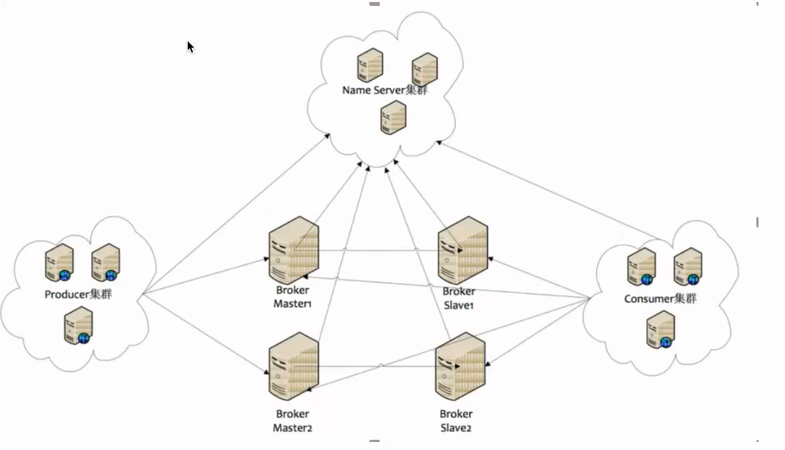

### Name Server

Name Server是一个几乎无状态节点，可集群部署，**节点之间无任何信息同步**。类似kafka的zk，但是zk是同步的。

### Broker

Broker部署相对复杂，Broker分为Master与Slave，一个Master可以对应多个Slave，但是一个Slave只能对应一个Master，Master与Slave的对应关系通过指定相同的Broker id，不同的Broker ld来定义，Brokerld为0表示Master，非0表示Slave。

每个Broker与Name Server集群中的所有节点建立长连接，定时(每隔30s)注册Topic信息到所有NameServer。Name Server定时(每隔10s)扫描所有存活broker的连接，如果Name Server超过2分钟没有收到心跳，则Name Server断开与Broker的连接。

注：和zk不同，Brocker会连接Name Server的集群上的每一个机子，将元数据（数据备份）存到上面。

### Producer 

Producer与Name Server集群中的其中一个节点(随机选择)建立长连接，定期从Name Server取Topic路由信息，并向提供Topic服务的Master建立长连接，且定时向Master发送心跳。Producer完全无状态，可集群部署。
Producer每隔30s (由ClientConfifig的pollNameServerInterval)从Name server获取所有topic队列的最新情况，这意味着如果Broker不可用，Producer最多30s能够感知，在此期间内发往Broker的所有消息都会失败。
producer每隔30s(由ClientConfifig中heartbeatBrokerInterval决定)向所有关联的broker发送心跳，Broker每隔10s中扫描所有存活的连接，如果Broker在2分钟内没有收到心跳数据，则关闭与Producer的连接。

### Consumer

consumer与Name Server集群中的其中一个节点(随机选择)建立长连接，定期从Name Server取Topic路由信息，并向提供Topic服务的Master、Slave建立长连接，且定时向Master、Slave发送心跳。Consumer既可以从Master订阅消息，也可以从Slave订阅消息，订阅规则由Broker配置决定。
Consumer每隔30s从Name server获取topic的最新队列情况，这意味着Broker不可用时，Consumer最多最需要30s才能感知。
Consumer每隔30s (由ClientConfifig中heartbeatBrokerInterval决定）向所有关联的broker发送心跳,Broker每隔10s扫描所有存活的连接，若某个连接2分钟内没有发送心跳数据，则关闭连接;并向该Consumer Group的所有Consumer发出通知，Group内的Consumer重新分配队列，然后继续消费。当Consumer得到master宕机通知后，转向slave消费，slave不能保证master的消息100%都同步过来了，因此会有少量的消息丢失。但是一旦master恢复，未同步过去的消息会被最终消费掉。
消费者对列是消费者连接之后(或者之前有连接过)才创建的。我们将原生的消费者标识由 (IP}@{消费者group}扩展为{IP}@{消费者groupHtopicHtag}，（例如xXX.XXX.XXX.xxx@mqtest_producer
group_2m2sTest_tag-zyk)。任何一个元素不同，都认为是不同的消费端，每个消费端会拥有一份自己消费对列（默认是broker对列数量*broker数量)。

## 关键特性及实现原理

### 顺序消费

消息有序指的是可以按照消息的发送顺序来消费。
例如:一笔订单产生了3条消息，分别是订单创建、订单付款、订单完成。消费时，必须按照顺序消费才有意义，与此同时多笔订单之间又是可以并行消费的。
例如生产者产生了2条消息∶M1、M2，要保证这两条消息的顺序，应该怎样做?可能脑中想到的是这样的:

#### 1、发送消息后接收确认消息

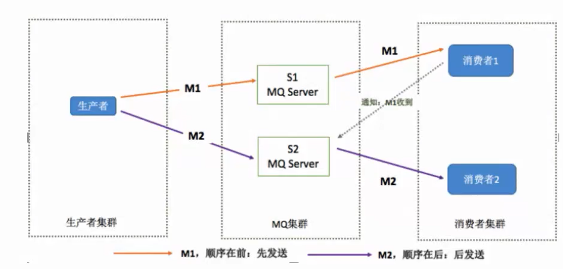

但是这个模型存在的问题是:如果M1和M2分别发送到两台Server上

> * 就不能保证M1先到达MQ集群
> * 也不能保证M1被先消费。

#### 2、FIFO（发送到同一server下）

​	换个角度看，如果M2先与M1到达MQ集群，甚至M2被消费后，M1才到达消费端，这时候消息就乱序了，说明以上模型是不能保证消息的顺序的。如何才能在MQ集群保证消息的顺序?一种简单的方式就是将M1、M2发送到同一个Server上:

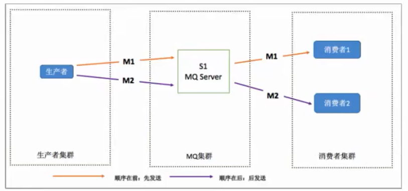

根据先到达先被消费的原则，M1会先于M2被消费，这样就保证了消息的顺序。FIFO
但是这个模型也仅仅是在理论上可以保证消息的顺序，在实际场景中可能会遇到下面的问题:网络延迟问题。

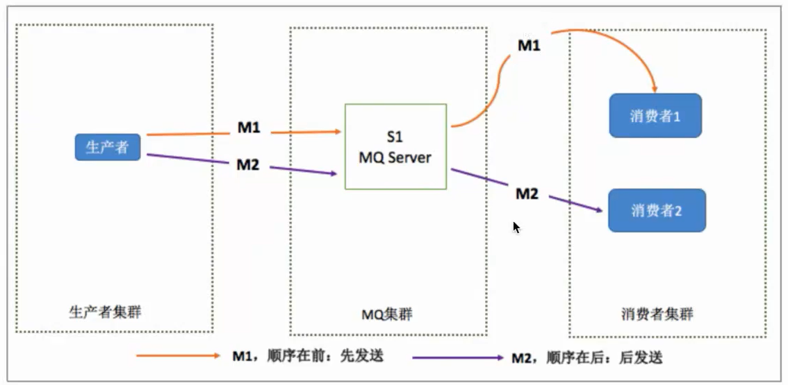

​	只要将消息从一台服务器发往另一台服务器，就会存在网络延迟问题，如上图所示，如果发送M1耗时大于发送M2耗时，那么仍然存在可能M2被先消费，仍然不能保证消息的顺序，即使M1和M2同时到达消费端，由于不清楚消费端1和消费端2的负载情况，仍然可能出现M2先于M1被消费的情况。
​	那如何解决这个问题呢?

#### 3、消息未得到确认再次发送

​	将M1和M2发往同一个server，且发送M1后，需要消费端响应成功后才能发送M2。
​	但是这里又会存在另外的问题:如果M1被发送到消费端后，消费端1没有响应，那么是继续发送M2呢，还是重新发送M1?一般来说为了保证消息一定被消费，肯定会选择重发M1到另外一个消费端2,如下图,保证消息顺序的正确方式:

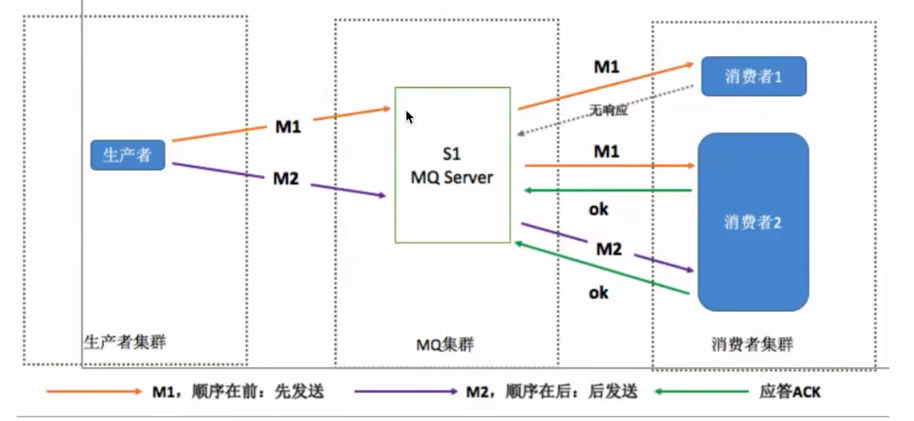

​	但是仍然会有问题:消费端1没有响应Server时，有两种情况，

> * 一种是M1确实没有到达(数据可能在网络传输中丢失)
>
> * 另一种是消费端已经消费M1并且已经发回响应消息，但是MQ Server没有收到。
>
>   如果是第二种情况，会导致M1被重复消费。

​	回过头来看消息顺序消费问题，严格的顺序消息非常容易理解，也可以通过文中所描述的方式来简化处理，总结起来，要实现严格的顺序消息,简单可行的办法就是:

>保证生产者-MQServer-消费者是”一对一对一”的关系。
>注意这样的设计方案问题:
>1.并行度会成为消息系统的瓶颈(吞吐量不够)
>2.产生更多的异常处理。比如︰只要消费端出现问题，就会导致整个处理流程阻塞，我们不得不花费更多的精力来解决阻塞的问题。

#### 4、Rocket MQ的局部有序性

我们最终的目标是要集群的高容错性和高吞吐量，这似乎是一对不可调和的矛盾，那么rocketmq是如何解决的呢?

>世界上解决一个计算机问题最简单的方法:“恰好”不需要解决它!—阿里资深技术专家沈询

有些问题，看起来很重要，但实际上我们可以通过合理的设计将问题分解来规避，如果硬要把时间花在解决问题本身，实际上不仅效率低下，而且也是一种浪费。从这个角度来看消息的顺序问题，可以得出两个结论:

>* 不关注乱序的应用大量存在
>
>* 队列无序并不意味着消息无序

所以从业务层面来保证消息的顺序，而不仅仅是依赖于消息系统，是不是我们更应该寻求的一种合理的方式?最后从源码角度分析	RocketMQ怎么实现发送顺序消息。
RocketMQ通过轮询所有队列的方式来确定消息被发送到哪一个队列（负载均衡策略）。

比如下面的,所以rocket mq也无法做到全局有序性，只能保证局部有序性。

```java
// RocketMQ通过MessageQueueSelector中实现的算法来确定消息发送到哪一个队列上
// RocketMQ默认提供了两种MessageQueueselector实现:随机/Hash
//当然你可以根据业务实现自己的MessageQueueselector来决定消息按照何种策略发送到消息队列中SendResult sendResult =   @Override
            public MessageQueue select(List<MessageQueue> mqs, Message msg, Object arg) {
                Integer id = (Integer) arg;
                int index = id % mqs.size();
                return mqs.get(index);
            }
            }, orderId);
```

在获取到路由信息以后，会根据MessageQueueSelector实现的算法来选择一个队列，同一个Orderld获取到的肯定是同一个队列。

```java
private SendResult send( ){//获取topic路由信息
TopicPublishInfo topicPublishInfo =
this.tryToFindTopicPublishInfo(msg. getTopic() );
if (topicPublishInfo != null && topicPublishInfo.ok( )){
    MessageQueue mq = null;
1/根据我们的算法，选择一个发送队列1/这里的arg = orderId
mq = selector.select(topicPublishinfo .getMessageQueueList( ), msg, arg);
    if(mq !=null){
return this.sendKernelimpl(msg,mq，communicationMode，sendcallback,timeout )
    }
}
                          };
```

### 消息重复

造成消息重复的根本原因是:网络不可达。

只要通过网络交换数据，就无法避免这个问题。所以解决这个问题的办法是绕过这个问题。那么问题就变成了:如果消费端收到两条一样的消息，应该怎样处理?

* 消费端处理消息的业务逻辑要保持幂等性。
  * 原理：只要保持幂等性，不管来多少条重复消息，最后处理的结果都一样。
  * 解决方案：很明显应该在消费端实现，不属于消息系统要实现的功能。
* 保证每条数据都有唯一编号，且保证消息处理成功与去重表的日志同时出现。
  * 原理：利用一张日志表来记录已经处理成功的消息的ID，如果新到的消息ID已经在日志表中，那么就不在处理这条消息。
  * 解决方案：由消息系统实现，也可以由业务端实现。正常情况下出现重复消息的概率其实很小，如果由消息系统来实现的话，肯定会对消息系统的吞吐量和高可用有影响，所以最好还是由业务端自己处理消息重复的问题，这也是RocketMQ不解决消息重复问题的原因。RocketMQ不保证消息不重复，如果你的业务系统需要保证严格的不重复消息,需要你自己在业务端去重。

### 事务消息

* 引入案例：小明购买一个100元的东西，账户扣款100元的同时需要保证在下游的积分系统给小明这个账号增加100积分。账号系统和积分系统是两个独立是系统，一个要减少100元，一个要增加100积分。
* 问题
  * 账号服务扣款成功了，通知积分系统也成功了，但是积分增加的时候失败了，数据不一致了。
  * 账号服务扣款成功了，但是通知积分系统失败了，所以积分不会增加，数据不一致了。
* 解决方案
  * RocketMQ针对第一个问题解决方案是：如果消费失败了，是会自动重试的，如果重试几次后还是消费失败，那么这种情况就需要人工解决了，比如放到死信队列里然后手动查原因进行处理等。
  * RocketMQ针对第二个问题解决方案是：如果你扣款成功了，但是往mq写消息的时候失败了，那么RocketMQ会进行回滚消息的操作，这时候我们也能回滚我们扣款的操作。

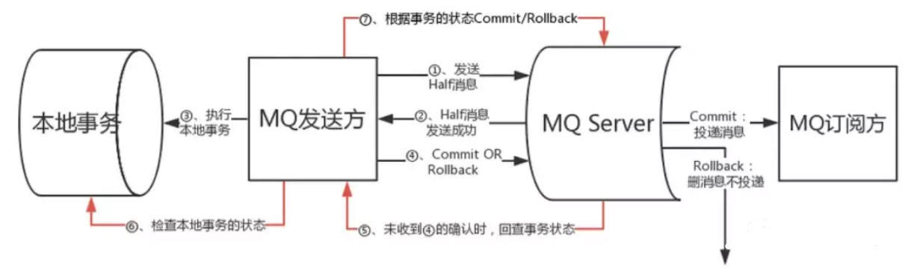

* 原理图解
  * Producer发送半消息（Half Message）到broker。
  * Half Message发送成功后开始执行本地事务。
  * 如果本地事务执行成功的话则返回commit，如果执行失败则返回rollback。（这个是在事务消息的回调方法里由开发者自己决定commit or rollback）Producer发送上一步的commit还是rollback到broker，这里有两种情况：
    * 如果broker收到了commit/rollback消息
      * 如果收到了commit，则broker认为整个事务是没问题的，执行成功的。那么会下发消息给Consumer端消费。
      * 如果收到了rollback，则broker认为本地事务执行失败了，broker将会删除Half Message，不下发给Consumer端。
    * 如果broker未收到消息（如果执行本地事务突然宕机了，相当本地事务执行结果返回unknow，则和broker未收到确认消息的情况一样处理。）
      * broker会定时回查本地事务的执行结果：如果回查结果是本地事务已经执行则返回commit，若未执行，则返回rollback。
      * Producer端回查的结果发送给Broker。Broker接收到的如果是commit，则broker视为整个事务执行成功，如果是rollback，则broker视为本地事务执行失败，broker删除Half Message，不下发给consumer。如果broker未接收到回查的结果（或者查到的是unknow），则broker会定时进行重复回查，以确保查到最终的事务结果。重复回查的时间间隔和次数都可配。

总结：事务消息是个监听器，有回调函数，回调函数里我们进行业务逻辑的操作，比如给账户-100元，然后发消息到积分的mq里，这时候如果账户-100成功了，且发送到mq成功了，则设置消息状态为commit，这时候broker会将这个半消息发送到真正的topic中。一开始发送他是存到半消息队列里的，并没存在真实topic的队列里。只有确认commit后才会转移。

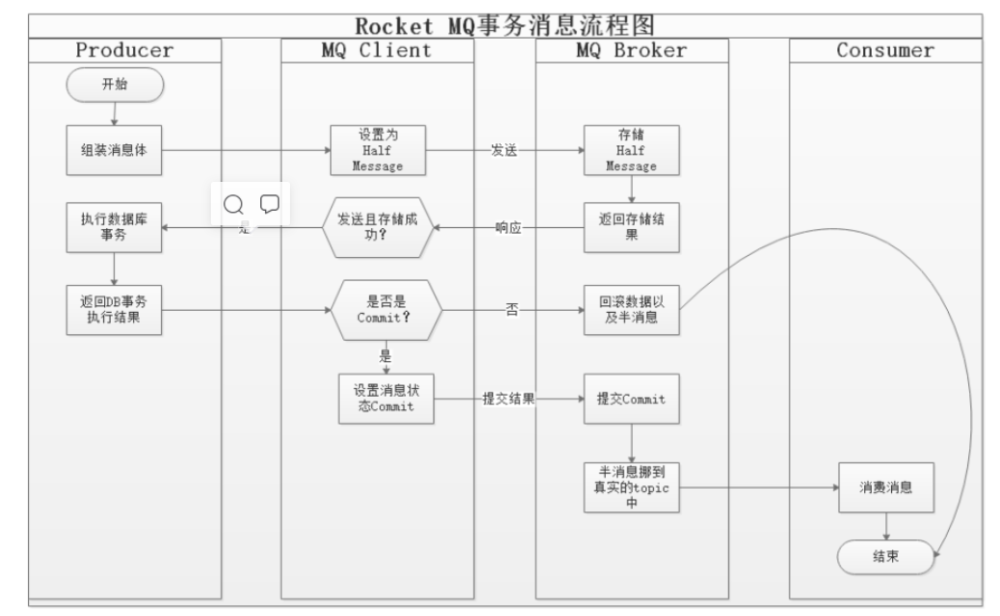

​	补救方案：如果事务因为中断，或是其他的网络原因，导致无法立即响应的，RocketMQ当做UNKNOW处理，RocketMQ事务消息还提供了一个补救方案：定时查询事务消息的事务状态。这也是一个回调函数，这里面可以做补偿，补偿逻辑开发者自己写，成功的话自己返回commit就完事了。

* 实现代码

```java
import org.apache.rocketmq.client.producer.LocalTransactionState;
import org.apache.rocketmq.client.producer.TransactionListener;
import org.apache.rocketmq.client.producer.TransactionMQProducer;
import org.apache.rocketmq.common.message.Message;
import org.apache.rocketmq.common.message.MessageExt;
/**
 * Description:
 *
 * @author TongWei.Chen 2020-06-21 11:32:58
 */
public class ProducerTransaction2 {
    public static void main(String[] args) throws Exception {
        TransactionMQProducer producer = new TransactionMQProducer("my-producer-group");
        producer.setNamesrvAddr("192.168.56.101:9876");
        // 回调
        producer.setTransactionListener(new TransactionListener() {
            /**
             * 用于监听是否回传
             * 用于UNKNOW
             */
            @Override
            public LocalTransactionState executeLocalTransaction(Message message, Object arg) {
                LocalTransactionState state = null;
                //msg-4返回COMMIT_MESSAGE
                if(message.getKeys().equals("msg-1")){
                    state = LocalTransactionState.COMMIT_MESSAGE;
                }
                //msg-5返回ROLLBACK_MESSAGE
                else if(message.getKeys().equals("msg-2")){
                    state = LocalTransactionState.ROLLBACK_MESSAGE;
                }else{
                    //这里返回unknown的目的是模拟执行本地事务突然宕机的情况（或者本地执行成功发送确认消息失败的场景）
                    state = LocalTransactionState.UNKNOW;
                }
                System.out.println(message.getKeys() + ",state:" + state);
                return state;
            }
 
            /**
             * 事务消息的回查方法
             * 用于UNKNOW
             */
            @Override
            public LocalTransactionState checkLocalTransaction(MessageExt messageExt) {
                if (null != messageExt.getKeys()) {
                    switch (messageExt.getKeys()) {
                        case "msg-3":
                            System.out.println("msg-3 unknow");
                            return LocalTransactionState.UNKNOW;
                        case "msg-4":
                            System.out.println("msg-4 COMMIT_MESSAGE");
                            return LocalTransactionState.COMMIT_MESSAGE;
                        case "msg-5":
                            //查询到本地事务执行失败，需要回滚消息。
                            System.out.println("msg-5 ROLLBACK_MESSAGE");
                            return LocalTransactionState.ROLLBACK_MESSAGE;
                    }
                }
                return LocalTransactionState.COMMIT_MESSAGE;
            }
        });
 
        producer.start();
 
        //模拟发送5条消息
        for (int i = 1; i < 6; i++) {
            try {
                Message msg = new Message("first-topic", null, "msg-" + i, ("测试，这是事务消息！ " + i).getBytes());
                producer.sendMessageInTransaction(msg, null);
            } catch (Exception e) {
                e.printStackTrace();
            }
        }
    }
}
```

* 运行结果和结果分析
  * msg-1：成功，因为一开始就返回了COMMIT_MESSAGE
  * msg-2：失败，因为一开始就提交了回滚
  * msg3-5：UNKNOW，进入回查，此时会间隔一小段时间就给3-5发一次消息确认
    * msg3：因为回查一直返回的是UNKNOW，所以一直回查msg3
    * msg4：回查返回了COMMIT_MESSAGE，所以成功发到了mq上
    * msg5：回查返回了回滚，所以不再回查。

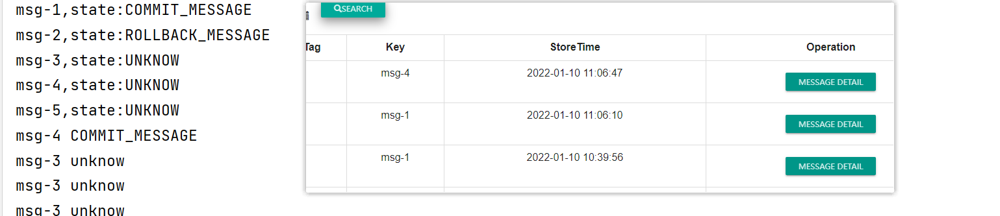

## 安装rocket mq

### 创建nameserver服务（注册broker）

* 拉取镜像

```shell
docker pull rocketmqinc/rocketmq
```

* 构建容器

```shell
docker run -d \
--restart=always \
--name rmqnamesrv \
-p 9876:9876 \
-v /home/rocketmq/data/namesrv/logs:/root/logs \
-v /home/rocketmq/data/namesrv/store:/root/store \
-e "MAX_POSSIBLE_HEAP=100000000" \
rocketmqinc/rocketmq:4.4.0 \
sh mqnamesrv
```

>-d	以守护进程的方式启动
>- -restart=always	docker重启时候容器自动重启
>- -name rmqnamesrv	把容器的名字设置为rmqnamesrv
>- -p 9876 : 9876	把容器内的端口9876挂载到宿主机9876上面
>- -v /docker/rocketmq/data/namesrv/logs:/root/logs	把容器内的/root/logs日志目录挂载到宿主机的 /docker/rocketmq/data/namesrv/logs目录
>- -v /docker/rocketmq/data/namesrv/store:/root/store	把容器内的/root/store数据存储目录挂载到宿主机的 /docker/rocketmq/data/namesrv目录
>- rmqnamesrv	容器的名字
>- -e “MAX_POSSIBLE_HEAP=100000000”	设置容器的最大堆内存为100000000
>- rocketmqinc/rocketmq	使用的镜像名称
>- sh mqnamesrv	启动namesrv服务

### 创建broke结点（消息转发）

* 创建配置文件

```shell
vim /home/rocketmq/conf/broker.conf
# 所属集群名称，如果节点较多可以配置多个
brokerClusterName = DefaultCluster
#broker名称，master和slave使用相同的名称，表明他们的主从关系
brokerName = broker-a
#0表示Master，大于0表示不同的slave
brokerId = 0
#表示几点做消息删除动作，默认是凌晨4点
deleteWhen = 04
#在磁盘上保留消息的时长，单位是小时
fileReservedTime = 48
#有三个值：SYNC_MASTER，ASYNC_MASTER，SLAVE；同步和异步表示Master和Slave之间同步数据的机制；
brokerRole = ASYNC_MASTER
#刷盘策略，取值为：ASYNC_FLUSH，SYNC_FLUSH表示同步刷盘和异步刷盘；SYNC_FLUSH消息写入磁盘后才返回成功状态，ASYNC_FLUSH不需要；
flushDiskType = ASYNC_FLUSH
# 设置broker节点所在服务器的ip地址
brokerIP1 = 192.168.52.136  # 注意：改成你的IP地址

```

* 构建brocker结点的docker容器

```shell
docker run -d  \
--restart=always \
--name rmqbroker \
--link rmqnamesrv:namesrv \
-p 10911:10911 \
-p 10909:10909 \
-v  /home/rocketmq/data/broker/logs:/root/logs \
-v  /home/rocketmq/data/broker/store:/root/store \
-v /home/rocketmq/conf/broker.conf:/opt/rocketmq-4.4.0/conf/broker.conf \
-e "NAMESRV_ADDR=namesrv:9876" \
-e "MAX_POSSIBLE_HEAP=200000000" \
rocketmqinc/rocketmq:4.4.0 \
sh mqbroker -c /opt/rocketmq-4.4.0/conf/broker.conf
```

>参数	说明
>
>* -d	以守护进程的方式启动
>* –restart=always	docker重启时候镜像自动重启
>
>- -name rmqbroker	把容器的名字设置为rmqbroker
>- --link rmqnamesrv : namesrv	和rmqnamesrv容器通信
>- -p 10911 :10911	把容器的非vip通道端口挂载到宿主机
>- -p 10909 : 10909	把容器的vip通道端口挂载到宿主机
>- -e “NAMESRV_ADDR= namesrv:9876”	指定namesrv的地址为本机namesrv的ip地址:9876
>- -e “MAX_POSSIBLE_HEAP=200000000”	rocketmqinc/rocketmq sh mqbroker 指定broker服务的最大堆内存
>- rocketmqinc/rocketmq	使用的镜像名称
>- sh mqbroker -c /docker/rocketmq/conf/broker.conf	指定配置文件启动broker节点，该配置文件对应上面 vim 编辑的配置文件

### 创建rockermq-console服务（页面显示）

```shell
docker run -d \
--restart=always \
--name rmqconsoleng2 \
-e "JAVA_OPTS=-Drocketmq.namesrv.addr=192.168.56.101:9876  
-Dcom.rocketmq.sendMessageWithVIPChannel=false 
-Duser.timezone='Asia/Shanghai'" \
-v /etc/localtime:/etc/localtime \
-p 8080:8080 \
styletang/rocketmq-console-ng
```

至此，rocket-mq搭建完成，踩了许多坑，真的烦，访问地址：http://192.168.56.101:8080/#/

## API学习

​	这部分，分成两部分，一个部分是消息的生产，一个部分是消息的消费。

### Producer

​	分为同步、批量、异步和Oneway（只负责投递，不管失败还是成功）。

发消息肯定要必备如下几个条件：

- 指定生产组名（不能用默认的，会报错）
- 配置namesrv地址（必须）
- 指定topic name（必须）
- 指定tag/key（可选）

验证消息是否发送成功：消息发送完后可以启动消费者进行消费，也可以去管控台上看消息是否存在。

#### send（同步）

```java
public class Product {
    public static void main(String[] args) throws MQClientException, MQBrokerException, RemotingException, InterruptedException {
        //指定生产组名为my-consumer-group
        DefaultMQProducer producer = new DefaultMQProducer("my-consumer-group");
        //配置namesrv地址
        producer.setNamesrvAddr("192.168.56.101:9876");
        //启动Producer
        producer.start();
        //创造消息对象,放入要传入的topic和消息本体
        Message msg = new Message("first-topic","这是一个product的api".getBytes(StandardCharsets.UTF_8));
        //发送消息到mq，同步
        SendResult result = producer.send(msg);
        System.out.println(result);
        producer.shutdown();
    }
}
```

#### send（批量）

```java
public class ProducerMultiMsg {
    public static void main(String[] args) throws Exception {
        // 指定生产组名为my-producer
        DefaultMQProducer producer = new DefaultMQProducer("my-producer");
        // 配置namesrv地址
        producer.setNamesrvAddr("124.57.180.156:9876");
        // 启动Producer
        producer.start();
 
        String topic = "myTopic001";
        // 创建消息对象，topic为：myTopic001，消息内容为：hello world1/2/3
        Message msg1 = new Message(topic, "hello world1".getBytes());
        Message msg2 = new Message(topic, "hello world2".getBytes());
        Message msg3 = new Message(topic, "hello world3".getBytes());
        // 创建消息对象的集合，用于批量发送
        List<Message> msgs = new ArrayList<>();
        msgs.add(msg1);
        msgs.add(msg2);
        msgs.add(msg3);
        // 批量发送的api的也是send()，只是他的重载方法支持List<Message>，同样是同步发送。
        SendResult result = producer.send(msgs);
        System.out.println("发送消息成功！result is : " + result);
        // 关闭Producer
        producer.shutdown();
        System.out.println("生产者 shutdown！");
    }
}
```

#### sedCallBack（异步）

```java
public class ProducerASync {
    public static void main(String[] args) throws Exception {
       // 指定生产组名为my-producer
        DefaultMQProducer producer = new DefaultMQProducer("my-producer");
        // 配置namesrv地址
        producer.setNamesrvAddr("124.57.180.156:9876");
        // 启动Producer
        producer.start();
 
        // 创建消息对象，topic为：myTopic001，消息内容为：hello world async
        Message msg = new Message("myTopic001", "hello world async".getBytes());
        // 进行异步发送，通过SendCallback接口来得知发送的结果
        producer.send(msg, new SendCallback() {
            // 发送成功的回调接口
            @Override
            public void onSuccess(SendResult sendResult) {
                System.out.println("发送消息成功！result is : " + sendResult);
            }
            // 发送失败的回调接口
            @Override
            public void onException(Throwable throwable) {
                throwable.printStackTrace();
                System.out.println("发送消息失败！result is : " + throwable.getMessage());
            }
        });
 
        Thread.sleep(1000);//这里特别注意，一定要停1s再shutdonw，否则可能没跑完就shutdown了，会报错
 	
        producer.shutdown();
        System.out.println("生产者 shutdown！");
    }
}
```

#### sendOneway

```java
public class ProducerOneWay {
    public static void main(String[] args) throws Exception {
        // 指定生产组名为my-producer
        DefaultMQProducer producer = new DefaultMQProducer("my-producer");
        // 配置namesrv地址
        producer.setNamesrvAddr("124.57.180.156:9876");
        // 启动Producer
        producer.start();
 
        // 创建消息对象，topic为：myTopic001，消息内容为：hello world oneway
        Message msg = new Message("myTopic001", "hello world oneway".getBytes());
        // 效率最高，因为oneway不关心是否发送成功，我就投递一下我就不管了。所以返回是void
        producer.sendOneway(msg);
        System.out.println("投递消息成功！，注意这里是投递成功，而不是发送消息成功哦！因为我sendOneway也不知道到底成没成功，我没返回值的。");
        producer.shutdown();
        System.out.println("生产者 shutdown！");
    }
}
```

#### 效率对比

sendOneway > sendCallBack > send批量 > send单条

* 很容易理解，sendOneway不求结果，我就负责投递，我不管你失败还是成功，相当于中转站，来了我就扔出去，我不进行任何其他处理。所以最快。

* 而sendCallBack是异步发送肯定比同步的效率高。

* send批量和send单条的效率也是分情况的，如果只有1条msg要发，那还搞毛批量，直接send单条完事。

### Consumer

**每个consumer只能关注一个topic。**

发消息肯定要必备如下几个条件：

- 指定消费组名（不能用默认的，会报错）
- 配置namesrv地址（必须）
- 指定topic name（必须）
- 指定tag/key（可选）

#### CLUSTERING

​	集群模式，默认。

​	比如启动五个Consumer，Producer生产一条消息后，Broker会选择五个Consumer中的其中一个进行消费这条消息，所以他属于点对点消费模式。

发消息肯定要必备如下几个条件：

- 指定消费组名（不能用默认的，会报错）
- 配置namesrv地址（必须）
- 指定topic name（必须）
- 指定tag/key（可选）

```java
public class Consumer {
    public static void main(String[] args) throws Exception {
        // 指定消费组名为my-consumer
        DefaultMQPushConsumer consumer = new DefaultMQPushConsumer("my-consumer");
        // 配置namesrv地址
        consumer.setNamesrvAddr("124.57.180.156:9876");
        // 订阅topic：myTopic001 下的全部消息（因为是*，*指定的是tag标签，代表全部消息，不进行任何过滤）
        consumer.subscribe("myTopic001", "*");
        // 注册监听器，进行消息消息。
        consumer.registerMessageListener(new MessageListenerConcurrently() {
            @Override
            public ConsumeConcurrentlyStatus consumeMessage(List<MessageExt> msgs, ConsumeConcurrentlyContext consumeConcurrentlyContext) {
                for (MessageExt msg : msgs) {
                    String str = new String(msg.getBody());
                    // 输出消息内容
                    System.out.println(str);
                }
                // 默认情况下，这条消息只会被一个consumer消费，这叫点对点消费模式。也就是集群模式。
                // ack确认
                return ConsumeConcurrentlyStatus.CONSUME_SUCCESS;
            }
        });
        // 启动消费者
        consumer.start();
        System.out.println("Consumer start");
    }
}
```

#### BROADCASTING

​	广播模式。

​	比如启动五个Consumer，Producer生产一条消息后，Broker会把这条消息广播到五个Consumer中，这五个Consumer分别消费一次，每个都消费一次。

```java
// 代码里只需要添加如下这句话即可：
consumer.setMessageModel(MessageModel.BROADCASTING); 
```

#### 两种模式对比

- 集群默认是默认的，广播模式是需要手动配置。
- 一条消息：集群模式下的多个Consumer只会有一个Consumer消费。广播模式下的每一个Consumer都会消费这条消息。
- 广播模式下，发送一条消息后，会被当前被广播的所有Consumer消费，但是后面新加入的Consumer不会消费这条消息，很好理解：村里面大喇叭喊了全村来领鸡蛋，第二天你们村新来个人，那个人肯定听不到昨天大喇叭喊的消息呀。

## 整合Springboot和Rocket MQ

这个整合，做好准备，非常的坎坷，如果遇到了bug可以看一下我整合的bug集，没有包含的，就自求多福了：

### 生产者

* 整体结构

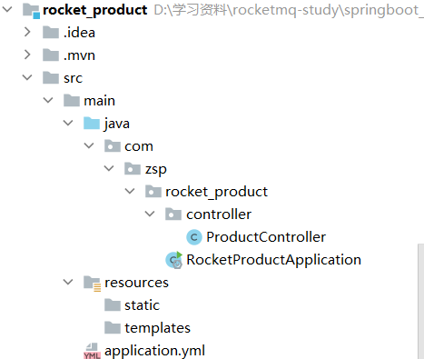

* 导入maven依赖：

```xml
    <dependencies>
        <dependency>
            <groupId>org.springframework.boot</groupId>
            <artifactId>spring-boot-starter-web</artifactId>
        </dependency>

        <dependency>
            <groupId>org.springframework.boot</groupId>
            <artifactId>spring-boot-starter-test</artifactId>
            <scope>test</scope>
        </dependency>
        <dependency>
            <groupId>org.springframework.boot</groupId>
            <artifactId>spring-boot-starter-test</artifactId>
            <scope>test</scope>
        </dependency>
        <!--lombok-->
        <dependency>
            <groupId>org.projectlombok</groupId>
            <artifactId>lombok</artifactId>
            <version>1.18.4</version>
            <scope>provided</scope>
        </dependency>
        <!--rocketmq-->
        <dependency>
            <groupId>org.apache.rocketmq</groupId>
            <artifactId>rocketmq-spring-boot-starter</artifactId>
            <version>2.1.1</version>
        </dependency>
    </dependencies>
```

* 写配置文件

```yml
server:
  port: 8082

rocketmq:
  name-server: 192.168.56.101:9876
  producer:
    group: my-producer-group

logging:
  file:
    path: /usr/log/mqproductservice/mqproductservice.log
  level:
    root: INFO
    com.anran.projectmanage.mapper: DEBUG
```

* 写接口

```java
/**
 * @author zsp
 * @version 1.0
 * @date 2022/1/6 14:17
 */
@RestController
@RequestMapping("/product")
public class ProductController {
    private static final Logger log = LoggerFactory.getLogger(ProductController.class);
    @Autowired
    RocketMQTemplate rocketMQTemplate;
    @GetMapping("/msg")
    public String getMsg(){
        try {
            rocketMQTemplate.convertAndSend("first-topic",
                    Thread.currentThread().getName()+"使用rocketmq生产了一条消息");
            log.info("发送成功");
            return "发送成功！";
        } catch (MessagingException e) {
            log.info("发送失败");
            return "发送失败"; }}
}
```

* 查看成功结果

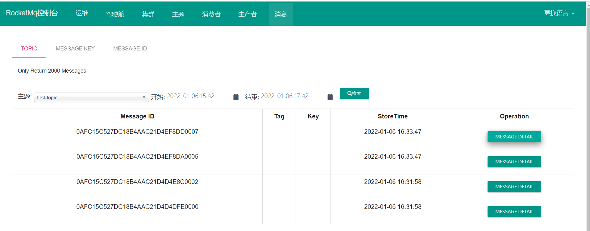

### 消费者

整体结构：

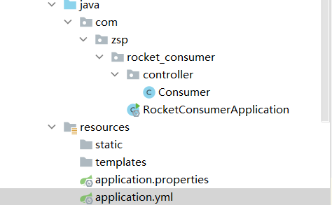

* 依赖同生产者
* 配置文件

```yml
server:
  port: 8083

#rocketmq配置信息
rocketmq:
  #nameservice服务器地址（多个以英文逗号隔开）
  name-server:  192.168.56.101:9876
  #消费者配置
  consumer:
    #组名
    group: my-producer-group
    #监听主题
    topic: first-topic
    #tags（监听多个tag时使用 || 进行分割，如果监听所有使用*或者不填）

logging:
  file:
    path: /usr/log/mqconsumerservice/mqconsumerservice.log
  level:
    root: INFO
    com.anran.projectmanage.mapper: DEBUG
```

* 编写接口

```java
@Component
@RocketMQMessageListener(topic = "first-topic",consumerGroup = "my-consumer-group")
@Slf4j
public class Consumer implements RocketMQListener<String> {
    @Override
    public void onMessage(String message) {
        System.out.println(message);
    }
}
```

* 查看成功结果

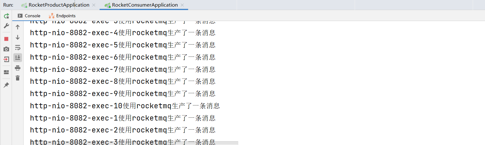

## bug集合

这个bug非常，非常的多，我快踩坑踩吐了...

#### bug1：时间不同步

* 出现时间不同步bug，先到容器内使用date，到主机也用date查看
  * 如果不一致，则将主机时间文件挂载到容器内（上面的容器创建代码已经修正）
  * 如果一致，则将主机时间同步到虚拟机时间上（我使用的是VirtualBox）
    * 先到VirtualBox的根目录D:\Program Files\Oracle\VirtualBox下，然后cmd打开
    * 接下来按以下输入就好了

```shell
D:\VirtualBox>VBoxManage list vms
"centos7" {360c208d-fa7a-427d-8cf9-dca0672fd0b6}
"centos7_2" {037d138b-d4d9-4684-a033-64e07dc89c92}

D:\VirtualBox>vboxmanage setextradata "centos7" "VBoxInternal/Devices/VMMDev/0/Config/GetHostTimeDisabled" "1"
```

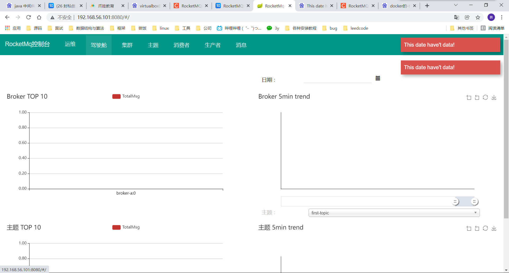

最终解决：

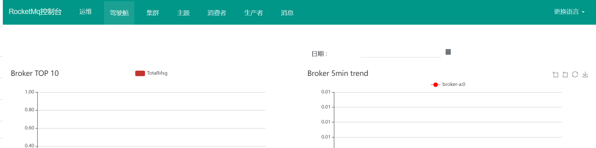

#### bug2：系统内存不足

报错类型：

```shell
service not available now, maybe disk full, CL: 0.95 CQ: 0.95 INDEX: 0.95, maybe your broker mach
```

报错原因：rocket mq默认存储盘占用超75%会出错

解决办法：调整这个比例到99，先到rocketmq的broker中

```shell
[rocketmq@e54d0f365667 bin]$ pwd  
/opt/rocketmq-4.4.0/bin
[rocketmq@e54d0f365667 bin]$ vi runbroker.sh
#在这个文件里面加上即可
JAVA_OPT="${JAVA_OPT} -Drocketmq.broker.diskSpaceWarningLevelRatio=0.99"
```

## Rocket MQ源码

​	先从消息发送源码开始，然后逐步完善其他模块源码，进入方法查看的快捷键是ctrl+鼠标左键。

### 消息发送源码

​	消息发送的流程图如下：

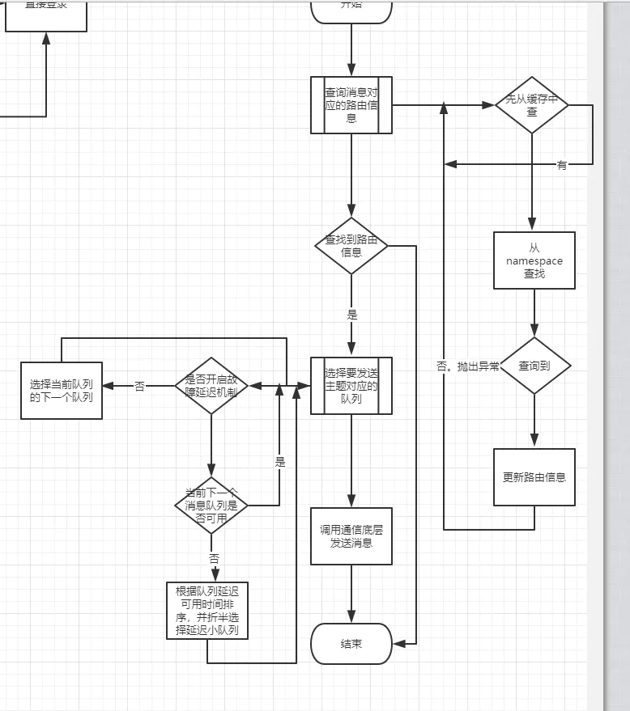

* 先自己写一个send出来，然后ctrl+鼠标左键跟进，选择第一个

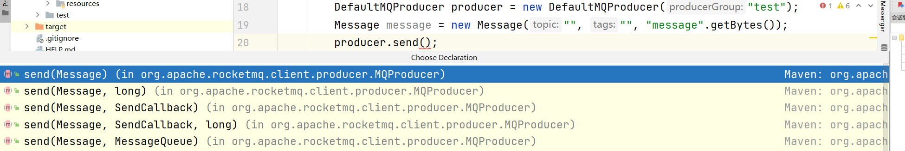

* 找到对应实现类

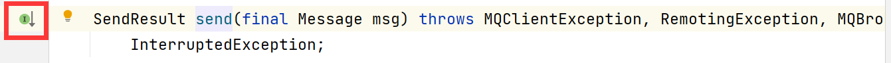

* 进入send方法，一共就执行了两个步骤
  * checkMessage：这个就不细说了，就是判断消息对象是否为空，消息和消息长度是否为空，或者长度超出最大长度（报错）
  * withNamespace：校验topic和namespace，校验完成后放入

```java
    @Override
    public SendResult send(
        Message msg) throws MQClientException, RemotingException, MQBrokerException, InterruptedException {
        Validators.checkMessage(msg, this);
        msg.setTopic(withNamespace(msg.getTopic()));
        return this.defaultMQProducerImpl.send(msg);
    }
```

* 再进入defaultMQProducerImpl的send方法内

```java
    public SendResult send(
        Message msg) throws MQClientException, RemotingException, MQBrokerException, InterruptedException {
        return send(msg, this.defaultMQProducer.getSendMsgTimeout());
    }
```

* 这一层放入了超时时间

```java
    public SendResult send(
        Message msg) throws MQClientException, RemotingException, MQBrokerException, InterruptedException {
        return send(msg, this.defaultMQProducer.getSendMsgTimeout());
    }
```

* 在进入send方法，这层放入了
  * CommunicationMode：通讯方式，包括同步、异步、单向。
  * null：回传方式，为空

```java
    public SendResult send(Message msg,
        long timeout) throws MQClientException, RemotingException, MQBrokerException, InterruptedException {
        return this.sendDefaultImpl(msg, CommunicationMode.SYNC, null, timeout);
    }
```

* 进入发送消息的主要方法，这里介绍下参数，代码按一行行注释进行学习
  * communicationMode：通讯方式，包括同步，异步，或单向
  * SendCallback：消息回传方式
  * timeout：超时时间
  * xxxTimestamp：单纯记录日志，标明是相同的一次请求

```java
    private SendResult sendDefaultImpl(
        Message msg,
        final CommunicationMode communicationMode,
        final SendCallback sendCallback,
        final long timeout
    ) throws MQClientException, RemotingException, MQBrokerException, InterruptedException {
        //验证服务器发送状态
        this.makeSureStateOK();
        //就是判断消息对象是否为空，消息和消息长度是否为空，或者长度超出最大长度（报错）
        Validators.checkMessage(msg, this.defaultMQProducer);
        //单纯记录日志，标明是相同的一次请求
        final long invokeID = random.nextLong();
        long beginTimestampFirst = System.currentTimeMillis();
        long beginTimestampPrev = beginTimestampFirst;
        long endTimestamp = beginTimestampFirst;
        //获取topic的发送路由信息，如果为空则通过netty从namesrv上获取（后面细说）
        TopicPublishInfo topicPublishInfo = this.tryToFindTopicPublishInfo(msg.getTopic());
        if (topicPublishInfo != null && topicPublishInfo.ok()) {
            boolean callTimeout = false; 
            MessageQueue mq = null;
            Exception exception = null;
            SendResult sendResult = null;
       	//根据异步、同步获得最大重发次数。判断通讯方式是同步吗？同步则为默认次数+1，就是2+1次，否则为1次
            int timesTotal = communicationMode == CommunicationMode.SYNC ? 1 + this.defaultMQProducer.getRetryTimesWhenSendFailed() : 1;
            int times = 0;
            //需要重试的次数
            String[] brokersSent = new String[timesTotal];
            for (; times < timesTotal; times++) {
                //mq不为空，则broker名字为mq取得的名字，否则为空
                String lastBrokerName = null == mq ? null : mq.getBrokerName();
                //获取需要发送的queue，这个选择是交给系统负载定义的选择器（后面细说）
                MessageQueue mqSelected = this.selectOneMessageQueue(topicPublishInfo, lastBrokerName);
                if (mqSelected != null) {
                    mq = mqSelected;
                    //用于记录当前队列的broker名
                    brokersSent[times] = mq.getBrokerName();
                    try {
                       //记录新的时间点
                        beginTimestampPrev = System.currentTimeMillis();
                        if (times > 0) {//如果发送次数大于0，则依据namespace重置topic
                            //Reset topic with namespace during resend
                            msg.setTopic(this.defaultMQProducer.withNamespace(msg.getTopic()));
                        }
                        //记录重试花费的时间
                        long costTime = beginTimestampPrev - beginTimestampFirst;
                        if (timeout < costTime) {//如果花费时间超过了超时时间，则设置超时，且退出循环
                            callTimeout = true;
                            break;
                        }
						//调用发送实际的操作（后面细说）
                        sendResult = this.sendKernelImpl(msg, mq, communicationMode, sendCallback, topicPublishInfo, timeout - costTime);
                        //得到结束时间
                        endTimestamp = System.currentTimeMillis();
                        //更新操作条目。传入broker的名字，花费时间，是否隔离
                        this.updateFaultItem(mq.getBrokerName(), endTimestamp - beginTimestampPrev, false);
                        //根据通讯方式进行返回，如果是异步和单路，则返回空，同步则返回
                        switch (communicationMode) {
                            case ASYNC:
                                return null;
                            case ONEWAY:
                                return null;
                            case SYNC:
                                if (sendResult.getSendStatus() != SendStatus.SEND_OK) {
                                    //获取发送状态，如果发送不成功则查看是否重试
                                    //是的话则退出当前循环，进入下一次循环
                                    if (this.defaultMQProducer.isRetryAnotherBrokerWhenNotStoreOK()) {
                                        continue;
                                    }
                                }
									//返回发送结果
                                return sendResult;
                            default:
                                break;
                        }
                    } catch (RemotingException e) {
                        //接下去就是对异常的一系列操作了，需要看的可以细看
                        endTimestamp = System.currentTimeMillis();
                        this.updateFaultItem(mq.getBrokerName(), endTimestamp - beginTimestampPrev, true);
                        log.warn(String.format("sendKernelImpl exception, resend at once, InvokeID: %s, RT: %sms, Broker: %s", invokeID, endTimestamp - beginTimestampPrev, mq), e);
                        log.warn(msg.toString());
                        exception = e;
                        continue;
                    } catch (MQClientException e) {
                        endTimestamp = System.currentTimeMillis();
                        this.updateFaultItem(mq.getBrokerName(), endTimestamp - beginTimestampPrev, true);
                        log.warn(String.format("sendKernelImpl exception, resend at once, InvokeID: %s, RT: %sms, Broker: %s", invokeID, endTimestamp - beginTimestampPrev, mq), e);
                        log.warn(msg.toString());
                        exception = e;
                        continue;
                    } catch (MQBrokerException e) {
                        endTimestamp = System.currentTimeMillis();
                        this.updateFaultItem(mq.getBrokerName(), endTimestamp - beginTimestampPrev, true);
                        log.warn(String.format("sendKernelImpl exception, resend at once, InvokeID: %s, RT: %sms, Broker: %s", invokeID, endTimestamp - beginTimestampPrev, mq), e);
                        log.warn(msg.toString());
                        exception = e;
                        switch (e.getResponseCode()) {
                            case ResponseCode.TOPIC_NOT_EXIST:
                            case ResponseCode.SERVICE_NOT_AVAILABLE:
                            case ResponseCode.SYSTEM_ERROR:
                            case ResponseCode.NO_PERMISSION:
                            case ResponseCode.NO_BUYER_ID:
                            case ResponseCode.NOT_IN_CURRENT_UNIT:
                                continue;
                            default:
                                if (sendResult != null) {
                                    return sendResult;
                                }

                                throw e;
                        }
                    } catch (InterruptedException e) {
                        endTimestamp = System.currentTimeMillis();
                        this.updateFaultItem(mq.getBrokerName(), endTimestamp - beginTimestampPrev, false);
                        log.warn(String.format("sendKernelImpl exception, throw exception, InvokeID: %s, RT: %sms, Broker: %s", invokeID, endTimestamp - beginTimestampPrev, mq), e);
                        log.warn(msg.toString());

                        log.warn("sendKernelImpl exception", e);
                        log.warn(msg.toString());
                        throw e;
                    }
                } else {
                    break;
                }
            }

            if (sendResult != null) {
                return sendResult; //结果不为空则返回
            }
			//整理提示信息格式
            String info = String.format("Send [%d] times, still failed, cost [%d]ms, Topic: %s, BrokersSent: %s",
                times,
                System.currentTimeMillis() - beginTimestampFirst,
                msg.getTopic(),
                Arrays.toString(brokersSent));
			//加上报错可以查看的网址（rocket mq的官网）
            info += FAQUrl.suggestTodo(FAQUrl.SEND_MSG_FAILED);
			//各种异常，该抛出的抛出
            MQClientException mqClientException = new MQClientException(info, exception);
            if (callTimeout) {
                throw new RemotingTooMuchRequestException("sendDefaultImpl call timeout");
            }
            if (exception instanceof MQBrokerException) {
                mqClientException.setResponseCode(((MQBrokerException) exception).getResponseCode());
            } else if (exception instanceof RemotingConnectException) {
                mqClientException.setResponseCode(ClientErrorCode.CONNECT_BROKER_EXCEPTION);
            } else if (exception instanceof RemotingTimeoutException) {
                mqClientException.setResponseCode(ClientErrorCode.ACCESS_BROKER_TIMEOUT);
            } else if (exception instanceof MQClientException) {
                mqClientException.setResponseCode(ClientErrorCode.BROKER_NOT_EXIST_EXCEPTION);
            }

            throw mqClientException;
        }
        validateNameServerSetting();
        throw new MQClientException("No route info of this topic: " + msg.getTopic() + FAQUrl.suggestTodo(FAQUrl.NO_TOPIC_ROUTE_INFO),
            null).setResponseCode(ClientErrorCode.NOT_FOUND_TOPIC_EXCEPTION);
    }
```

### 事务消息源码

* 从sendMessageInTransaction进入事务消息的源码中

```java
        DefaultMQProducer producer = new DefaultMQProducer("test");
        producer.sendMessageInTransaction();
```

* 进入第二个实现接口sendMessageInTransaction中

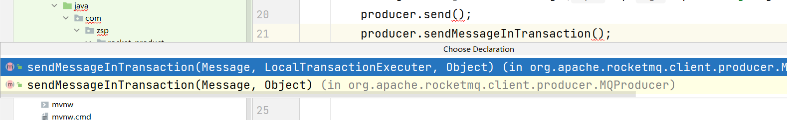

* 找到sendMessageInTransaction

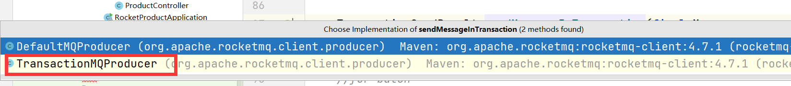

* 进入方法查看
  * 判断是否存在监听对象：mq事务消息一定需要设置producer中transactionListener对象，用于本地事务执行及本地事务执行状态回查
  * withNamespace：校验topic和namespace，校验完成后放入

```java
    @Override
    public TransactionSendResult sendMessageInTransaction(final Message msg,
        final Object arg) throws MQClientException {
        if (null == this.transactionListener) {
            throw new MQClientException("TransactionListener is null", null);
        }
        msg.setTopic(NamespaceUtil.wrapNamespace(this.getNamespace(), msg.getTopic()));
        return this.defaultMQProducerImpl.sendMessageInTransaction(msg, null, arg);
    }
```

* 跟进sendMessageInTransaction查看

```java
    public TransactionSendResult sendMessageInTransaction(final Message msg,
        final LocalTransactionExecuter localTransactionExecuter, final Object arg)
        throws MQClientException {
        //获取事务监听器
        TransactionListener transactionListener = getCheckListener();
        //本地事务执行器为空或事务监听器为空，则抛异常
        if (null == localTransactionExecuter && null == transactionListener) {
            throw new MQClientException("tranExecutor is null", null);
        }
        //事务消息不支持延迟特性(清空延迟等级)
        if (msg.getDelayTimeLevel() != 0) {
            MessageAccessor.clearProperty(msg, MessageConst.PROPERTY_DELAY_TIME_LEVEL);
        }
        //判断消息对象是否为空，topic是否为空或超出长度、消息本体是否为空或者超出最大长度
        //出现上面中的任一个问题都抛异常
        Validators.checkMessage(msg, this.defaultMQProducer);
        //初始化用来存发送结果
        SendResult sendResult = null;
        //预处理，在扩展字段中设置消息类型， TRAN_MSG：当前时事务half消息 / PGROUP：生产者组名
        MessageAccessor.putProperty(msg, MessageConst.PROPERTY_TRANSACTION_PREPARED, "true");
        MessageAccessor.putProperty(msg, MessageConst.PROPERTY_PRODUCER_GROUP, this.defaultMQProducer.getProducerGroup());
        try {
            sendResult = this.send(msg);
        } catch (Exception e) {
            throw new MQClientException("send message Exception", e);
        }
        //设置本地事务状态为未知
        LocalTransactionState localTransactionState = LocalTransactionState.UNKNOW;
        //设置异常为空，用于存储异常
        Throwable localException = null;
        //使用发送状态进行选择执行
        switch (sendResult.getSendStatus()) {
		//half消息发送成功则执行
            case SEND_OK: { 
                	//保证发送消息事务的id不为空
                	//与properties中的其他name对比，查看是否已经存在，存在抛异常
                	//校验事务id不为空，最终，将“__transactionId__”作为key，事务id作为value存入properties中
                    if (sendResult.getTransactionId() != null) {
                        msg.putUserProperty("__transactionId__", sendResult.getTransactionId());
                    }
                	//从msg实体中获取唯一事务id
                    String transactionId = msg.getProperty(MessageConst.PROPERTY_UNIQ_CLIENT_MESSAGE_ID_KEYIDX);
                	//保证消息事务id不为空，将其放入
                    if (null != transactionId && !"".equals(transactionId)) {
                        msg.setTransactionId(transactionId);
                    }
                    //如果本地事务执行器不为空，则使用本地事务执行器进行，返回执行结果(执行本地事务)
                    if (null != localTransactionExecuter) {
                        localTransactionState = localTransactionExecuter.executeLocalTransactionBranch(msg, arg);				//如果监听器不为空，则执行监听器,保存本地事务执行结果（执行写的监听器）
                    } else if (transactionListener != null) {
                        log.debug("Used new transaction API");
                        localTransactionState = transactionListener.executeLocalTransaction(msg, arg);
                    }
               		//如果本地执行状态为空，则本地消息回传为UNKNOW
                    if (null == localTransactionState) {
                        localTransactionState = LocalTransactionState.UNKNOW;
                    }
					//如果执行结果不为UNKNOW也不为COMMIT_MESSAGE，则日志提示事务状态
                    if (localTransactionState != LocalTransactionState.COMMIT_MESSAGE) {
                        log.info("executeLocalTransactionBranch return {}", localTransactionState);
                        log.info(msg.toString());
                    }
                	//捕获异常
                } catch (Throwable e) {
                    log.info("executeLocalTransactionBranch exception", e);
                    log.info(msg.toString());
                	//保存出现的异常状态
                    localException = e;
                }
            }
        		
            break;
        	//如果预备消息half message发送超时
            case FLUSH_DISK_TIMEOUT:
            case FLUSH_SLAVE_TIMEOUT:
            case SLAVE_NOT_AVAILABLE:
                localTransactionState = LocalTransactionState.ROLLBACK_MESSAGE; //返回回滚的状态
                break;
            default:
                break;
        }
        try {//最终返回half message的发送结果，本地事务执行结果，抛出的异常
            this.endTransaction(sendResult, localTransactionState, localException);
        } catch (Exception e) {
            log.warn("local transaction execute " + localTransactionState + ", but end broker transaction failed", e);
        }
		//放入结果、发送状态、消息队列名、消息id、事务消息id和事务消息状态等等
        TransactionSendResult transactionSendResult = new TransactionSendResult();
        transactionSendResult.setSendStatus(sendResult.getSendStatus());
        transactionSendResult.setMessageQueue(sendResult.getMessageQueue());
        transactionSendResult.setMsgId(sendResult.getMsgId());
        transactionSendResult.setQueueOffset(sendResult.getQueueOffset());
        transactionSendResult.setTransactionId(sendResult.getTransactionId());
        transactionSendResult.setLocalTransactionState(localTransactionState);
		//返回这个结果状态
        return transactionSendResult;
    }
```

​	至此消息事务消息源码解析完毕。
